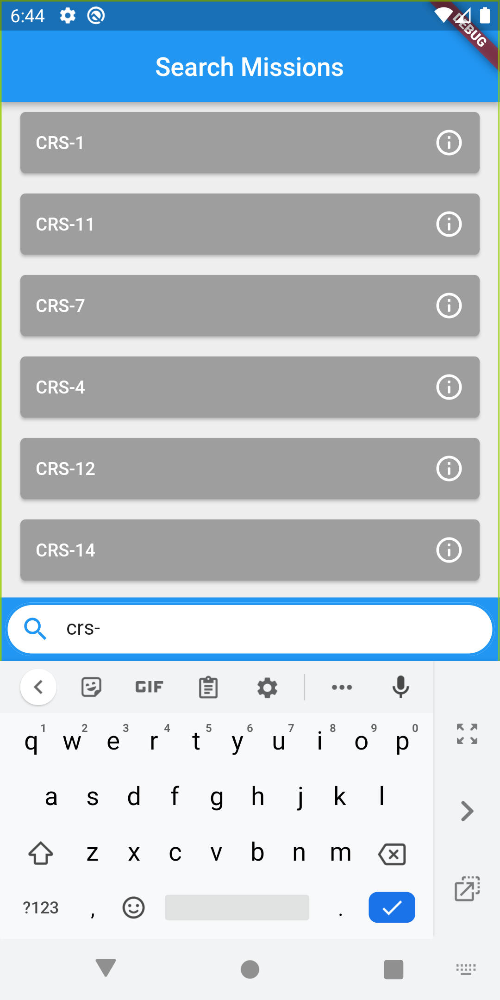
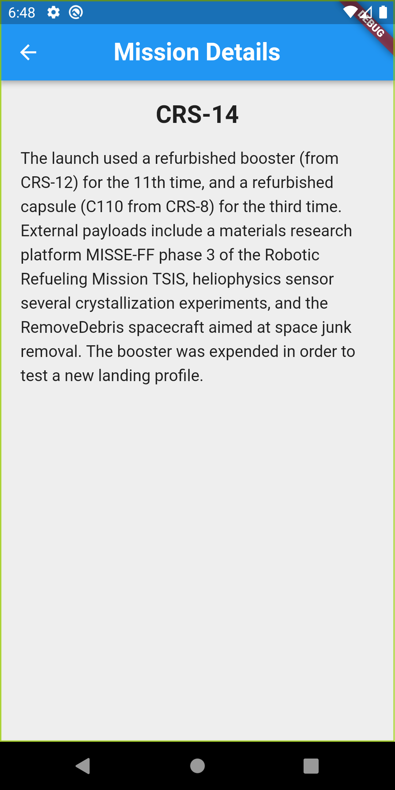

# A Flutter Repo Using SpaceX API

- Infinite Scroll using  [pull_to_refresh](https://pub.dev/packages/pull_to_refresh) package
- [SpaceX API with GraphQL](https://api.spacex.land/graphql/) is used.

**APK File Google Drive Link**

[https://drive.google.com/file/d/1VU-Bt2QssR-cT-58YCAH2Z7E10RJy9yJ/view?usp=sharing](https://drive.google.com/file/d/1VU-Bt2QssR-cT-58YCAH2Z7E10RJy9yJ/view?usp=sharing)

- **Some ScreenShots**

** **

